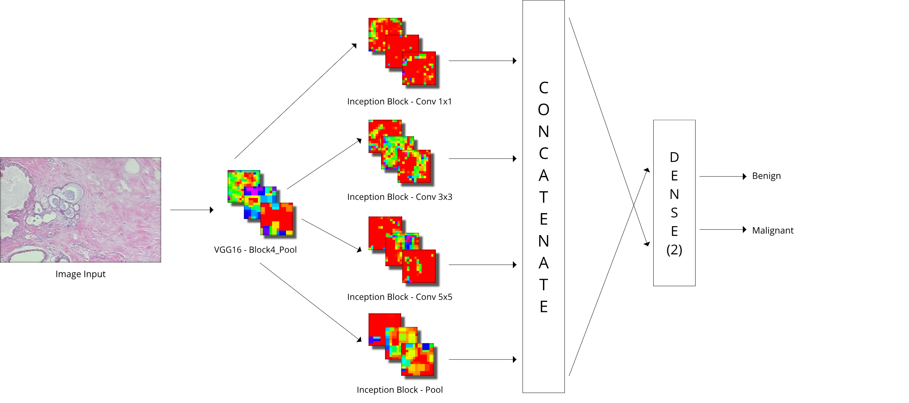
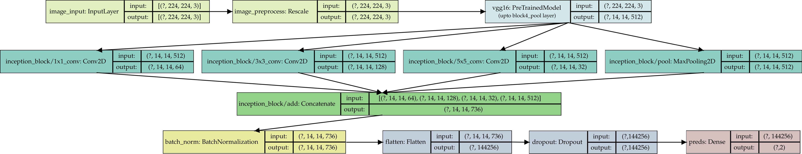
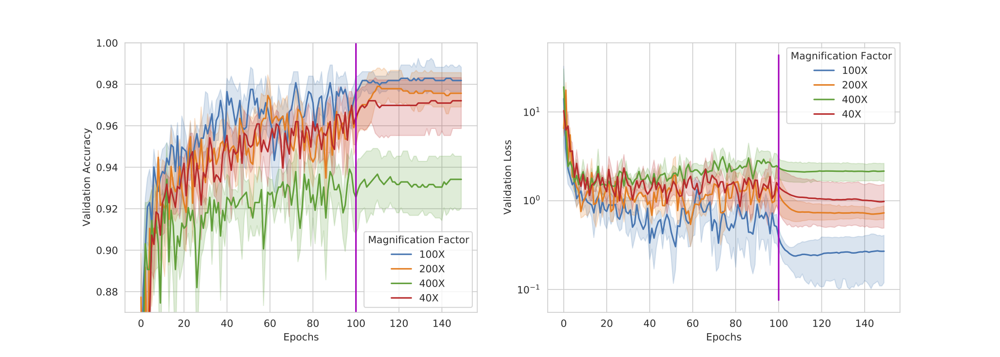

# VGGIN-Net for Imbalanced Breast Cancer Classification

## Proposed Approach

Proposed **VGGIN-Net** for breast cancer classification on **BREAKHIS**:

> Notebook for code (w/o results): [[ipynb]](./VGGINET-SemiFinal/VGGINET.ipynb)
>
> [TensorBoard.dev](https://tensorboard.dev) aggregating all training and validation metrics: https://tensorboard.dev/experiment/PSnYyZUWTBem4dLvQYNm2g/

Proposed **VGGIN-Net** with **Fine Tuning** for breast cancer classification on **BREAKHIS**:

>
> [TensorBoard.dev](https://tensorboard.dev) aggregating all training and validation metrics: https://tensorboard.dev/experiment/P7EkvFxPQgSWGqAPhE7w2A/
>
> Learning curves on validation set: 
